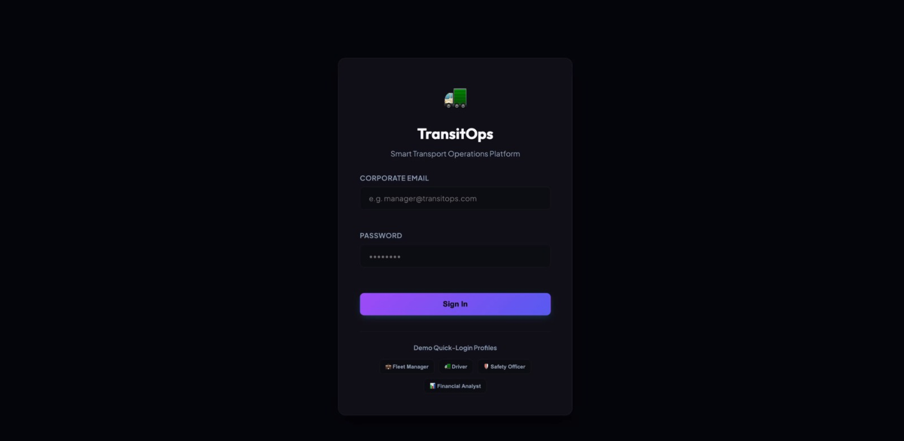
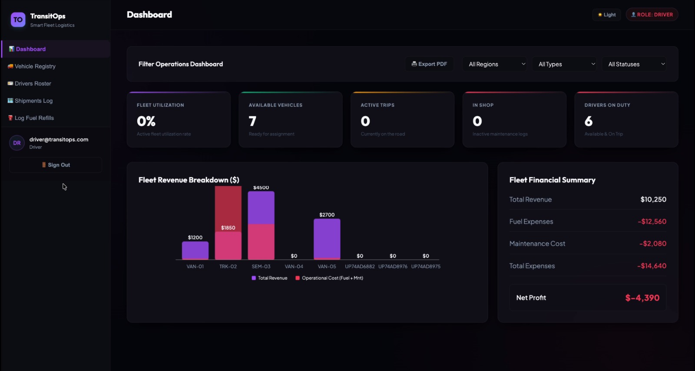

<p align="center">
  
</p>

<h1 align="center">🚌 TransitOps</h1>

<p align="center">
A smart public transportation management platform developed during a hackathon to improve urban mobility through real-time transit tracking, route optimization, and data-driven insights.
</p>

<p align="center">

<a href="YOUR_LIVE_DEMO_LINK">

</a>

<a href="YOUR_GITHUB_REPO_LINK">

</a>

</p>

<p align="center">


</p>

---

# 📖 About The Project

TransitOps is a hackathon project designed to simplify public transportation management by providing real-time transit monitoring, route planning, and operational insights.

The platform focuses on improving commuter experience through an intuitive interface, optimized transit operations, and efficient data visualization.

Built with modern web technologies, the project demonstrates full-stack development, REST API integration, responsive design, and collaborative software development.

---

# ✨ Features

- 🚌 Real-Time Transit Dashboard
- 📍 Live Vehicle Tracking
- 🗺️ Route Planning
- 📊 Analytics Dashboard
- 👥 User Authentication
- 🔔 Smart Notifications
- 📱 Responsive Design
- ⚡ Fast Performance
- 🎨 Modern UI
- 🔒 Secure Data Management

---

# 📸 Screenshots

<div align="center">

### 🏠 Dashboard



<br><br>


</div>

---

# 🛠 Tech Stack

| Category | Technologies |
|-----------|--------------|
| 🎨 Frontend | React.js, Vite |
| ⚙️ Backend | Node.js, Express.js |
| 🗄️ Database | MongoDB |
| 🎨 Styling | Tailwind CSS |
| 🌐 API | REST API |
| 💻 Language | JavaScript |
| 🔧 Tools | Git, GitHub |

---

# 📂 Project Structure

```bash
TransitOps
│
├── client
├── server
├── screenshots
├── package.json
├── README.md
└── .env
```

---

# ⚙️ Installation

### Clone Repository

```bash
git clone https://github.com/yourusername/TransitOps.git
```

### Navigate to Project

```bash
cd TransitOps
```

### Install Dependencies

```bash
npm install
```

### Configure Environment Variables

```env
MONGODB_URI=YOUR_DATABASE_URL
JWT_SECRET=YOUR_SECRET_KEY
```

### Run Development Server

```bash
npm run dev
```

---

# 💡 What I Learned

Working on this hackathon project helped me improve my skills in:

- Full Stack Development
- Team Collaboration
- REST API Development
- Database Integration
- Responsive UI Design
- Git & GitHub Workflow
- Problem Solving Under Time Constraints
- Rapid Prototyping

---

<p align="center">
🏆 Built with passion during a Hackathon 🚀
</p>